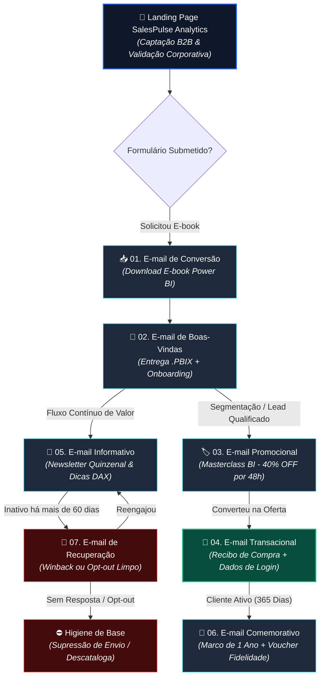

# 📬 Coleção de Templates de E-mail Marketing (HTML & CSS Bulletproof)

Repositório técnico contendo 7 estilos essenciais de e-mail marketing desenvolvidos do zero com foco em compatibilidade multiplataforma (Microsoft Outlook, Gmail, Apple Mail e mobile), estratégias de CRM, entregabilidade e otimização de conversão (CRO).

Este projeto complementa o ecossistema da [Landing Page B2B SalesPulse Analytics](https://millerknoc.github.io/lp-dashboard-powerbi/).

---

## 🧭 Matriz de Templates Desenvolvidos

| # | Estilo de E-mail | Objetivo de Negócio / CRM | Desafio Técnico de Renderização |
|---|---|---|---|
| **01** | [Conversão](./emails/01-conversao-ebook/) | Download de material rico (E-book de Power BI) | Preheader invisível com espaçadores e CTA bulletproof. |
| **02** | [Boas-Vindas](./emails/02-boas-vindas/) | Onboarding e warm-up de domínio (IP) | Passos visuais em células aninhadas e estímulo à resposta. |
| **03** | [Promocional](./emails/03-promocional/) | Oferta comercial da Masterclass (40% OFF) | Pricing Card contrastante e tarja de escassez sem scripts. |
| **04** | [Transacional](./emails/04-transacional/) | Confirmação de compra e envio de credenciais | Tabela de recibo detalhada com compliance institucional (CNPJ). |
| **05** | [Informativo](./emails/05-informativo/) | Nutrição técnica via newsletter quinzenal | Grelha de 2 colunas fluida com empilhamento vertical e botões de feedback. |
| **06** | [Comemorativo](./emails/06-comemorativo/) | Retenção & fidelidade (marco de 1 ano) | Voucher de desconto estilo ticket com bordas pontilhadas (`dashed`). |
| **07** | [Recuperação](./emails/07-recuperacao/) | Reengajamento (*winback*) e higiene de base | Decisão em dois caminhos claros (permanecer ou pausar envios). |

---

## 🛠️ Padrões e Boas Práticas Adotadas

* **Arquitetura Baseada em Tabelas (`<table>`):** Estrutura 100% retrocompatível com o motor do Word (Microsoft Outlook Windows).
* **Largura Máxima Padrão:** Layouts travados em 600px centralizados com `margin: 0 auto;`.
* **CSS Inline & MSO Conditional Support:** Estilos críticos aplicados inline para garantir consistência visual no Gmail app.
* **Acessibilidade & Boas Práticas Anti-Spam:** Relação texto-imagem balanceada (sem uso de "fatiamento de imagem única"), links semânticos e conformidade com LGPD/CAN-SPAM.

---

## 🧪 Como Visualizar Localmente

1. Clone este repositório:
   ```bash
   git clone [https://github.com/SEU_USUARIO/email-marketing-portfolio.git](https://github.com/SEU_USUARIO/email-marketing-portfolio.git)

   ## 🗺️ Fluxo de Ciclo de Vida do Lead (Lifecycle & Jornada de CRM)

O diagrama abaixo ilustra como cada uma das 7 peças de e-mail marketing se conecta estrategicamente ao ecossistema de captação iniciado na [Landing Page B2B](https://millerknoc.github.io/lp-dashboard-powerbi/):

